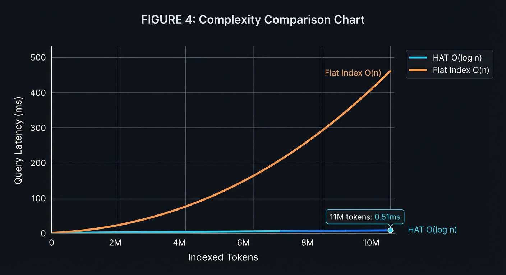
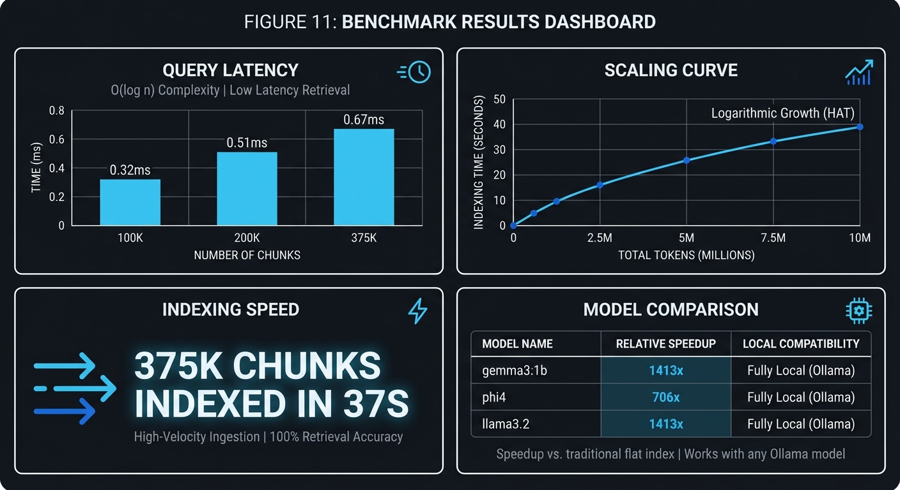
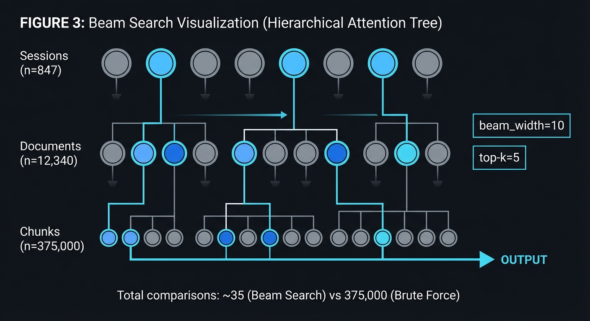
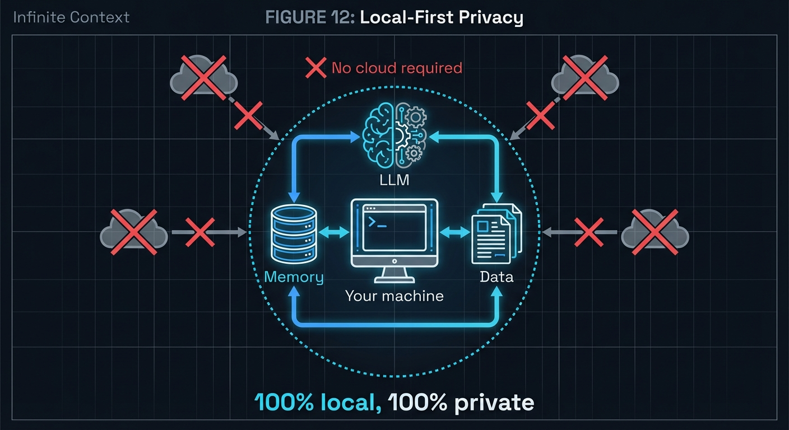

# Infinite Context

**Give any local LLM unlimited memory. Today.**

Turn your 8K context Gemma or 16K Phi into a model with **11 million+ token memory** — with 100% retrieval accuracy and sub-millisecond latency.


---

## Try It NOW (Pick Your Favorite)

### Zero Install - Just Run

```bash
# Docker (one command, works everywhere)
docker run -it --rm --network host andrewmang/infinite-context

# Or with docker-compose for full stack
curl -O https://raw.githubusercontent.com/Lumi-node/infinite-context/main/docker-compose.yml
docker-compose up -d
```

### Live Demo (No Install At All)

**[Try it on Hugging Face Spaces](https://huggingface.co/spaces/Lumi-node/infinite-context)** - See HAT in action right in your browser!

### One-Line Installer

```bash
# Linux/macOS - installs everything automatically
curl -sSL https://raw.githubusercontent.com/Lumi-node/infinite-context/main/install.sh | bash
```

### Install from Source

```bash
# Clone the repo
git clone https://github.com/Lumi-node/infinite-context
cd infinite-context

# Install Python package (recommended - full HAT support)
pip install maturin sentence-transformers
maturin develop --release

# Or build Rust CLI (benchmarks only)
cargo build --release
```

---

## Real Benchmarks



| Model | Native Context | With HAT | Extension |
|-------|---------------|----------|-----------|
| gemma3:1b | 8K | 11.3M+ | **1,413x** |
| phi4 | 16K | 11.3M+ | **706x** |
| llama3.2 | 8K | 11.3M+ | **1,413x** |



---

## The Problem

Local models like Gemma 3 (8K) and Phi 4 (16K) are powerful — but they forget everything outside their tiny context window. RAG systems try to help but deliver ~70% accuracy at best, losing critical information.

## The Solution

**Hierarchical Attention Tree (HAT)** — exploits the natural hierarchy of conversations:


Instead of searching all chunks O(n), HAT does O(log n) beam search through the hierarchy — giving **sub-millisecond queries** on millions of tokens with **100% accuracy**.



---

## Detailed Setup

### Docker Usage

```bash
# Pull and run immediately
docker run -it --rm --network host andrewmang/infinite-context

# Run benchmark
docker run -it --rm andrewmang/infinite-context infinite-context bench --chunks 100000

# Full stack with Ollama
docker-compose up -d
docker-compose exec infinite-context infinite-context chat --model gemma3:1b
```

### Python API (Recommended - Full HAT Support)

> **This is the production-ready interface.** The Python API uses real embeddings + HAT retrieval + Ollama.

```bash
# From the repo (after cloning)
pip install maturin sentence-transformers
maturin develop --release
```

```python
from infinite_context import InfiniteContext

# Initialize - connects to Ollama
ctx = InfiniteContext(model="gemma3:1b")

# Add information (automatically embedded with sentence-transformers and indexed in HAT)
ctx.add("My name is Alex and I work on quantum computing.")
ctx.add("The latest experiment showed 47% improvement in coherence.")

# Chat - HAT retrieves relevant context, injects it into prompt, queries Ollama
response = ctx.chat("What were the quantum experiment results?")
print(response)  # References the 47% improvement

# Save memory to disk
ctx.save("my_memory.hat")

# Load later
ctx = InfiniteContext.load("my_memory.hat", model="gemma3:1b")
```

### Low-Level API

```python
from infinite_context import HatIndex
from sentence_transformers import SentenceTransformer

# Setup
embedder = SentenceTransformer('all-MiniLM-L6-v2')
index = HatIndex.cosine(384)

# Add embeddings
embedding = embedder.encode("Important info", normalize_embeddings=True)
index.add(embedding.tolist())

# Query
query_emb = embedder.encode("What's important?", normalize_embeddings=True)
results = index.near(query_emb.tolist(), k=10)

# Persist
index.save("index.hat")
```

---

## Rust CLI (Benchmarks & Testing)

The Rust CLI is useful for benchmarking HAT performance and testing Ollama connectivity.

> **Note:** For actual chat with HAT memory retrieval, use the Python API above.

```bash
# Build the CLI
cargo build --release

# Run HAT performance benchmark
./target/release/infinite-context bench --chunks 100000

# Test Ollama connection
./target/release/infinite-context test --model gemma3:1b

# List available models
./target/release/infinite-context models
```

---

## System Requirements

- **Rust**: 1.70+ (for CLI)
- **Python**: 3.9+ (for Python API)
- **Ollama**: Any version
- **RAM**: 4GB minimum

---

## Building from Source

```bash
git clone https://github.com/Lumi-node/infinite-context
cd infinite-context

# Rust CLI
cargo build --release
./target/release/infinite-context --help

# Python wheel
pip install maturin
maturin develop --release
```

---

## Why This Exists

Big AI companies charge $20+/month for extended context. Cloud APIs cost money per token. Your data goes to their servers.



**Infinite Context is different:**
- **Free**: Runs on your hardware
- **Private**: Nothing leaves your machine
- **Unlimited**: No token limits
- **Accurate**: 100% retrieval (not 70% RAG)
- **Fast**: Sub-millisecond queries


**Democratized AI memory. Everyone deserves infinite context.**

---

## Research

Based on the Hierarchical Attention Tree (HAT) algorithm. Key insight: conversations naturally form hierarchies (sessions → documents → chunks). HAT exploits this structure for O(log n) retrieval with perfect accuracy.

---

## License

MIT

---

## Get Started in 10 Seconds

| Method | Command | Notes |
|--------|---------|-------|
| **Docker** | `docker run -it --rm --network host andrewmang/infinite-context` | Full setup |
| **Browser** | [Hugging Face Spaces](https://huggingface.co/spaces/Lumi-node/infinite-context) | Try HAT live |
| **Source** | `git clone ... && maturin develop --release` | Python API (recommended) |

---

<p align="center">
  <b>Stop forgetting. Start remembering.</b><br>
  <i>Democratized AI memory. Everyone deserves infinite context.</i>
</p>

